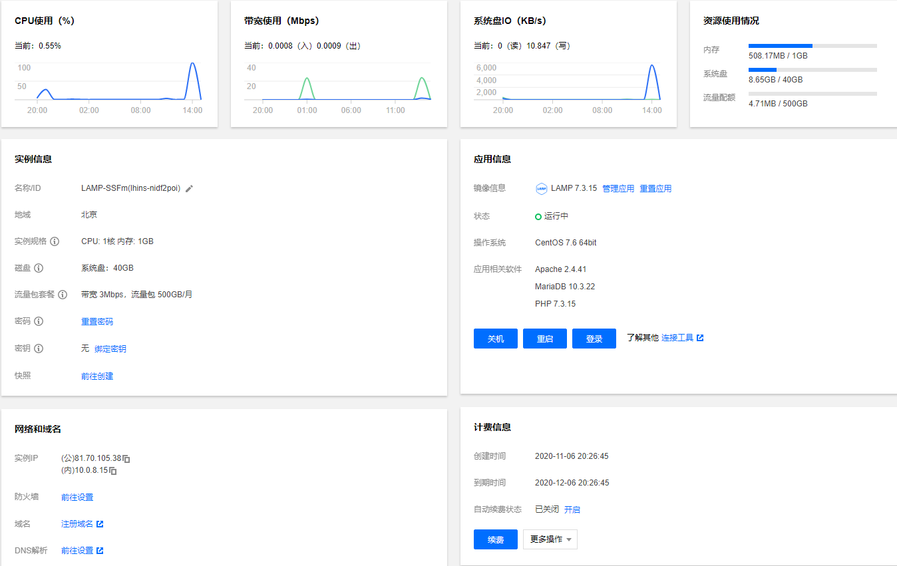
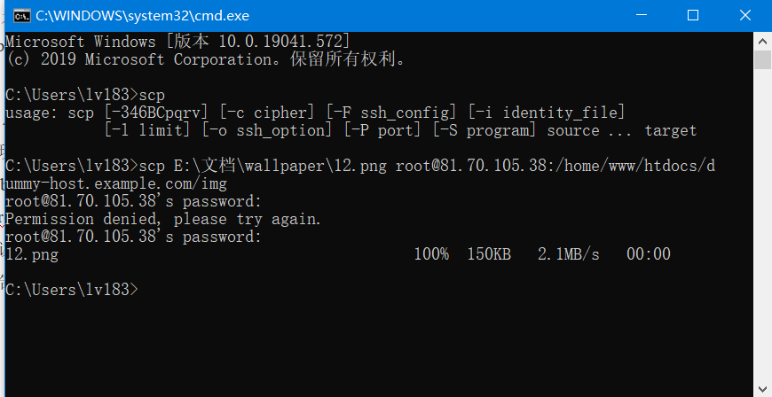
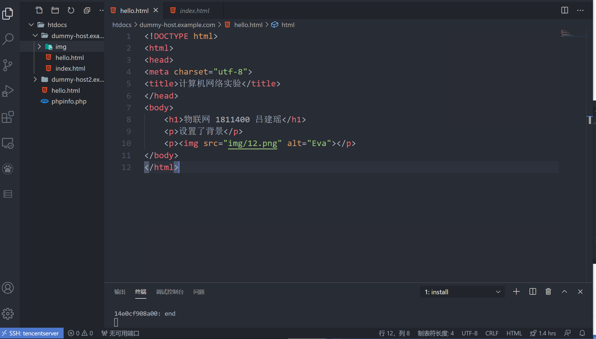
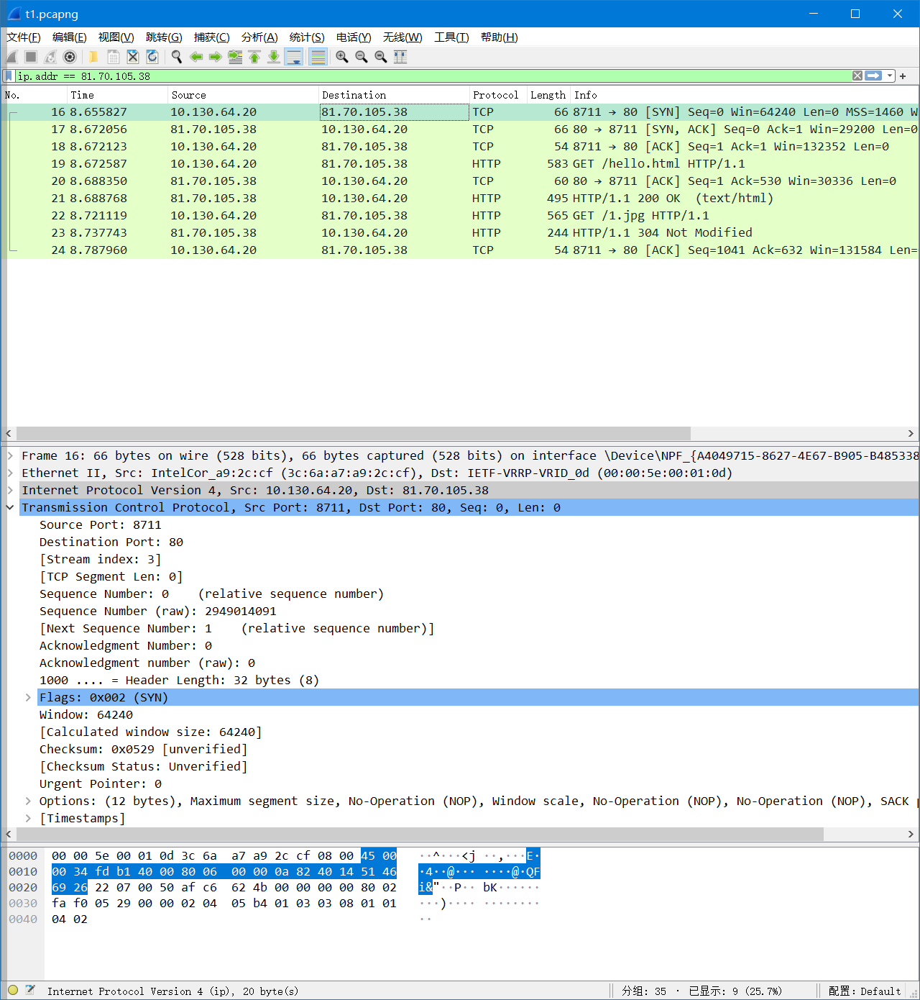
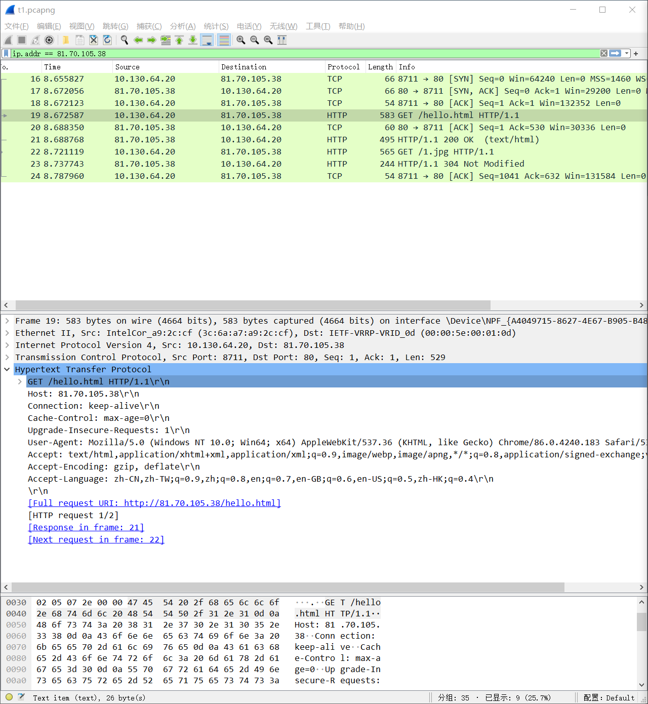
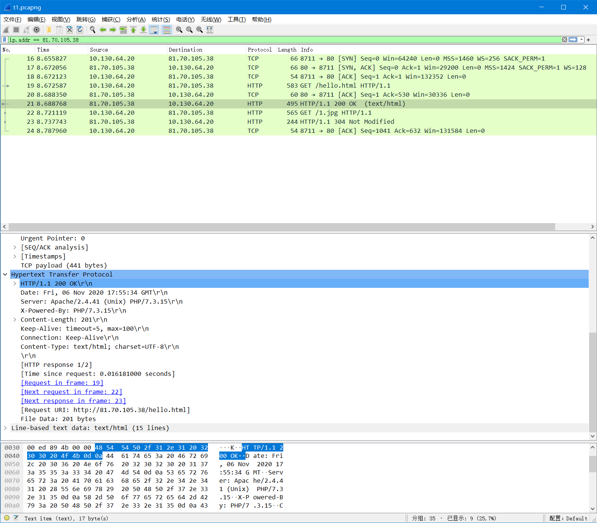

#  LAB2

##  Web服务器搭建

### 1.平台介绍

为了简单方便，我选择了腾讯云的LAMP环境服务器，操作系统为CentOS 7.6 64bit。

支持软件具体版本为 Apache 2.4.41、MariaDB 10.3.22、PHP 7.3.15。

使用microsoft 的新版edge浏览器打开网页。



### 2.连接工具介绍

提交html文档可以在本地编写完之后直接使用windows命令行工具scp 上传到服务器。

命令格式为`scp /path/filename username@servername:/path/`

下图是我用scp上传一个图片到服务器的例子。



为了方便使用Vs code 的Remote-SSH工具进行远程连接和开发。连接服务器后打开文件直接进行编辑即可。



### 3.编写html文档

一个简单的html;只包含文本和一个图片

```html
<!DOCTYPE html>
<html>
<head>
<meta charset="utf-8">
<title>计算机网络实验</title>
</head>
<body>
    <h1>物联网 1811400 吕建瑶</h1>
	<p>设置了背景</p>
	<p></p>
</body>
</html>
```


##  页面访问&wireshark抓包分析

> 使用wireshark监听WLAN连接，使用ip.address == 81.70.105.38进行过滤

> 三次握手



前三行是客户端向服务器发起的TCP连接的三次握手的过程：

1.客户端向服务器发送SYN包，进入SYN_SENT状态，等待服务器确认；SYN：同步序列编号（Synchronize Sequence Numbers）。

2.服务器收到SYN包后发送SYN+ACK包，此时服务器进入SYN_RECV状态。

3.客户端收到服务器的SYN+ACK包，向服务器发送确认包ACK，此包发送完毕，客户端和服务器进入ESTABLISHED状态，完成三次握手。

> HTTP请求



第四行信息显示客户端向服务器发送了一个HTTP请求报文。

```html
GET /hello.html HTTP/1.1\r\n  	#指定当前浏览器使用的HTTP版本为1.1
Host: 81.70.105.38\r\n			#服务器地址
Connection: kepp-alive\r\n		#持久连接
Cache-Control: max-age=0\r\n	#缓存控制
Upgrade-Insecure-Requests: 1\r\n
User-Agent: Mozilla/5.0 (Windows NT 10.0; Win64; x64) AppleWebKit/537.36 (KHTML, like Gecko) Chrome/86.0.4240.183 Safari/537.36 Edg/86.0.622.63\r\n
Accept:text/html,application/xhtml+xml,application/xml;q=0.9,image/webp,image/apng,*/*;q=0.8,application/signed-exchange;v=b3;q=0.9\r\n
Accept-Encoding: gzip, deflate\r\n
Accept-Language: zh-CN,zh-TW;q=0.9,zh;q=0.8,en;q=0.7,en-GB;q=0.6,en-US;q=0.5,zh-HK;q=0.4\r\n
\r\n
```

令人疑惑的是，浏览器的内核明明是chromium，但是在HTTP的报文的User-agent处却标注为 Mozilla。经查阅了解到这是一个历史问题。



服务器收到客户端的HTTP请求之后，返回一个HTTP响应报文，状态字为200，意为成功处理了客户端的请求。

```tcp
HTTP/1.1 200 OK\r\n								#意为成功处理了客户端的请求。
Date: Fri, 06 Nov 2020 17:55:34 GMT\r\n			#时间
Server: Apache/2.4.41 (Unix) PHP/7.3.15\r\n		#服务器信息
X-Powered-By: PHP/7.3.15\r\n
Content-Length: 201\r\n
Keep-Alive: timeout=5, max=100\r\n
Connection: Keep-Alive\r\n
Content-Type: text/html; charset=UTF-8\r\n		#内容类型为HTML
\r\n
```

随后客户端在解析html中发现图片文件，再次向服务器发送HTTP请求

```
GET /1.jpg HTTP/1.1\r\n
Host: 81.70.105.38\r\n
Connection: keep-alive\r\n
User-Agent: Mozilla/5.0 (Windows NT 10.0; Win64; x64) AppleWebKit/537.36 (KHTML, like Gecko) Chrome/86.0.4240.183 Safari/537.36 Edg/86.0.622.63\r\n
Accept: image/webp,image/apng,image/*,*/*;q=0.8\r\n
Referer: http://81.70.105.38/hello.html\r\n
Accept-Encoding: gzip, deflate\r\n
Accept-Language: zh-CN,zh-TW;q=0.9,zh;q=0.8,en;q=0.7,en-GB;q=0.6,en-US;q=0.5,zh-HK;q=0.4\r\n
If-None-Match: "b74a-5b373a3029583"\r\n
If-Modified-Since: Fri, 06 Nov 2020 17:35:21 GMT\r\n		#浏览器缓存的最后服务器修改时间
\r\n
```

If-None-Match 原理是这样的，当浏览器请求服务器的某项资源(A)时, 服务器根据A算出一个哈希值(3f80f-1b6-3e1cb03b)并通过 ETag 返回给浏览器，浏览器把"b74a-5b373a3029583" 和 A 同时缓存在本地，当下次再次向服务器请求A时，会通过类似 `If-None-Match: "b74a-5b373a3029583"\r\n` 的请求头把ETag发送给服务器，服务器再次计算A的哈希值并和浏览器返回的值做比较，如果发现A发生了变化就把A返回给浏览器(此时响应报文状态码为200)，如果发现A没有变化就给浏览器返回一个空的响应体（状态码304）。这样通过控制浏览器端的缓存，可以节省服务器的带宽，因为服务器不需要每次都把全量数据返回给客户端。


