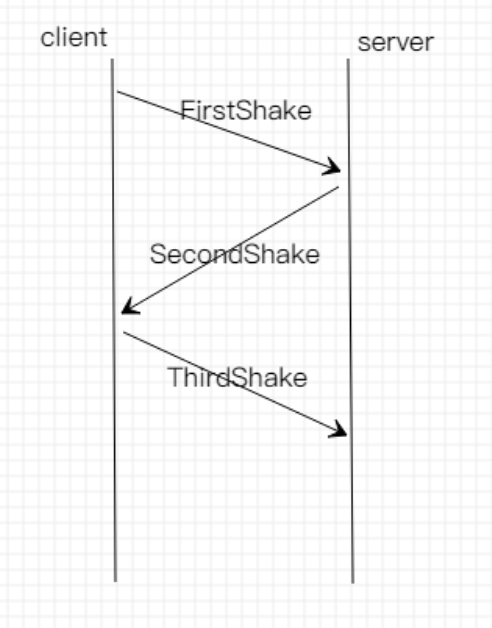

## 任务

> 利用数据报套接字在用户空间实现面向连接的可靠数据传输，功能包括：建立连接、差错检测、确认重传。流量控制采用停等机制，完成给定测试文件的传输.

### 协议设计

#### 建立连接阶段



```c++
//client:
while(true){
		//package[0]为检验和
		char shake_package[2];
		shake_package[1] = FSHAKE;
		shake_package[0] = checksum(shake_package + 1,1);
    	//发送第一次握手pkt
		sendto(client, shake_package, 2, 0, (sockaddr *) &serverAddr, sizeof(serverAddr));
		int begin = clock();
		char recv[2];
		int len = sizeof(clientAddr);
		int fail = 0;
    	//接受服务端发来的第二次握手pkt
		while(recvfrom(client, recv, 2, 0, (sockaddr *) &serverAddr, &len) == SOCKET_ERROR){
			if (clock() - begin > MAX_WAIT_TIME) {
                fail = 1;
                //超时重新发送第一次握手pkt(重新开始连接)
                break;
            }
		}
    	//不超时,pkt不出错且是第二次握手包,则发送第三次握手包-连接成功
		if(fail == 0 && checksum(recv,2) == 0 && recv[1] == SSHAKE)
		{
			shake_package[1] = TSHAKE;
			shake_package[0] = checksum(shake_package + 1,1);
			sendto(client, shake_package, 2, 0, (sockaddr *) &serverAddr, sizeof(serverAddr));
            break;
		}
	}
//server:
	while(true){
		char revshake[2];
		int len_tmp = sizeof(clientAddr);
		while (recvfrom(server, revshake, 2, 0, (sockaddr *) &clientAddr, &len_tmp) == SOCKET_ERROR);
		if(checksum(revshake,2)!=0 || revshake[1] != FSHAKE){
			continue;//如果收到的pkt不是第一次握手,回到接收状态
		}
		while(true){//收到第一次握手pkt之后,向客户端发送第二次握手
			revshake[1] = SSHAKE;
			revshake[0] = checksum(revshake + 1,1);
			sendto(server, revshake, 2, 0, (sockaddr *) &clientAddr, sizeof(clientAddr));
            while (recvfrom(server, revshake, 2, 0, (sockaddr *) &clientAddr, &len_tmp) == SOCKET_ERROR);//等待收取第三次握手pkt
            if (checksum(revshake, 2) == 0 && revshake[1] == FSHAKE)
                //如果收到的pkt是第一次握手,那么再次向客户端发送第二次握手
                continue;
            if (checksum(revshake, 2) == 0 && revshake[1] == TSHAKE)
                //收到第三次pkt,连接完成
                break;
            if (checksum(revshake, 2) != 0 || revshake[1] != TSHAKE) {
                //收到的pkt有问题,连接失败
                printf("error");
                return 0;
            }
		}
		break;
	}

```


#### 差错检测

使用校验和进行校验

```c++
unsigned char checksum(char *package,int len){
	if (len == 0){
		return ~(0);
	}
    unsigned int sum = 0;
    int i = 0;
    while(len--){
        sum += (unsigned char) package[i++];
        if(sum & 0xFF00){
            sum &= 0x00FF;
            sum++;
        } 
    }
    return ~(sum&0x00FF);
}
```

#### 确认重传

```c++
	while(true){
		sendto(client, real_package, tmp_len, 0, (sockaddr *) &serverAddr, sizeof(serverAddr));
		int begin = clock();
		char recv[3];
		int len_tmp = sizeof(serverAddr);
		int fail = 0;
		
		while (recvfrom(client, recv, 3, 0, (sockaddr *) &serverAddr, &len_tmp) == SOCKET_ERROR){    
			if (clock() - begin > MAX_WAIT_TIME) {
                fail = 1;
                break;
            }
        }
        //出现超时,校验和,NAK或者pkt序列号不是期待序列号时,重传,否则完成传输
        if (fail == 0 && checksum(recv, 3) == 0 && recv[1] == ACK && recv[2] == (char)serial_num)
            return true;
	}
}
```

#### 停等

显然,此协议是一个停等协议,当客户端发送完一个pkt时,等待接收ACK/NAK的pkt时,程序是阻塞的.

